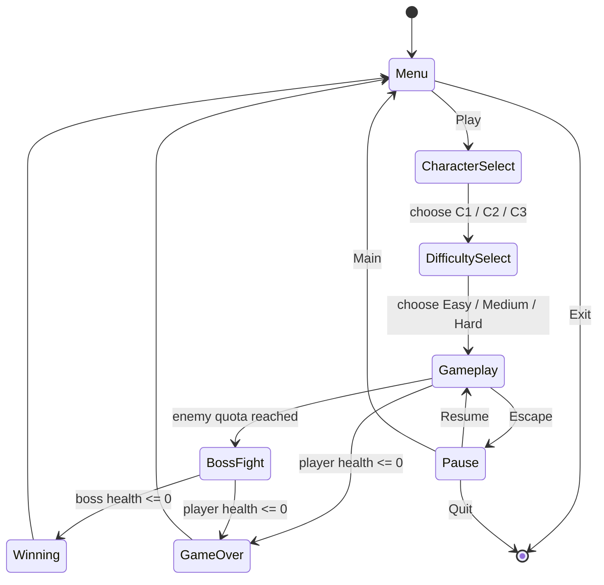

# RUINS — 2D Action Shooter in C with SDL2


-0078d6)


Side-scrolling action shooter written from scratch in C using the SDL2 library family. Three selectable characters with distinct stat trade-offs, three difficulty tiers that alter enemy pressure and damage scaling, wave-based zombie combat and a boss encounter — all built on a hand-written game loop with no engine.

## Project Description

RUINS is a complete 2D shooter implemented in a single 1,946-line C translation unit. The player selects one of three characters, picks a difficulty, and survives waves of zombies while building toward a boss fight. Clearing the difficulty-specific enemy quota summons the boss; defeating it wins the game, and losing all health ends it.

Everything is written directly against SDL2 — there is no game engine, no scene graph, and no entity-component framework. Rendering, collision detection, animation timing, spawn scheduling, audio mixing, input handling and screen-state transitions are all implemented manually.

The project covers four SDL2 subsystems:

| Subsystem | Used for |
| --- | --- |
| `SDL2` | Window creation, renderer, event loop, texture blitting |
| `SDL2_image` | Loading PNG and JPG sprites and screen backgrounds |
| `SDL2_ttf` | Rendering health, boss health and score text |
| `SDL2_mixer` | Background music playlist and sound effects |

Intended readers are programmers interested in low-level game loop construction, fixed-timestep scheduling without a framework, and manual state management in C.

### Key features

- Three playable characters with genuinely different stat profiles rather than cosmetic variation
- Three difficulty tiers that independently scale enemy damage, fireball damage, spawn ceiling and boss threshold
- Independent millisecond-based timers for spawning, movement, retargeting and sprite animation
- Boss encounter with a separate health pool and a fireball attack pattern
- Seven distinct screen states with mouse-driven navigation
- In-game music player cycling a three-track playlist without interrupting play
- Score tracking with per-kill and boss-clear rewards

## What Problem Does It Solve?

This is a learning project rather than a solution to an external problem. Its purpose is to build a complete, playable game without an engine, and the engineering problems it addresses are the ones a framework would normally hide.

**Problems the implementation has to solve directly:**

- **No engine means no game loop.** Event polling, state updating and rendering must be structured by hand, with every screen transition handled explicitly.
- **Frame-rate-independent timing.** Enemy spawning, movement, retargeting and sprite animation all need to advance on wall-clock intervals rather than per frame, or behaviour changes with rendering speed. The implementation keeps a separate `last_tick_*` timestamp per behaviour on each entity.
- **Manual collision detection.** Every interaction — bullet against enemy, bullet against boss, player against enemy, fireball against player — is an explicit axis-aligned bounding box test.
- **Fixed-capacity entity management without dynamic allocation.** Enemies, bullets and fireballs live in fixed-size arrays with `isAlive` / `isActive` flags, so slots are recycled rather than allocated and freed.
- **Difficulty that actually changes the game.** Rather than a single multiplier, each tier adjusts four independent parameters, so the difficulty curve is shaped rather than merely scaled.
- **Resource lifetime management.** Textures, fonts, music and audio chunks are all manually loaded and freed, including when the music track is swapped mid-game.

**What the design achieves:**

- Character choice is a real strategic decision because health and damage move in opposite directions.
- Enemy behaviour stays consistent regardless of the machine's frame rate.
- Restarting resets cleanly through a single `initialize_game()` entry point rather than scattered state resets.
- Music can be changed during play without stopping the game loop.

## Tech Stack

| Category | Technologies |
| --- | --- |
| Programming Language | C |
| Graphics / Windowing | SDL2 |
| Image Loading | SDL2_image (PNG, JPG) |
| Text Rendering | SDL2_ttf |
| Audio | SDL2_mixer (MP3 music and sound effects) |
| Compiler | MinGW-w64 GCC (MSYS2, 32-bit toolchain) |
| Build System | VS Code `tasks.json` shell task |
| Version Control | Git |

## Methodology

### Game state flow



### Data model

Five plain structs carry all game state:

| Struct | Fields | Notes |
| --- | --- | --- |
| `Player` | `x`, `y`, `speed`, `health`, `isAlive`, `score`, `damage_cooldown`, `move` | `damage_cooldown` prevents contact damage applying every frame |
| `Enemy` | position, direction, `enemy_index`, `health`, `isAlive`, three tick timestamps, `texture` | Three independent timers per enemy for spawn, movement and retargeting |
| `Boss` | `x`, `y`, `health`, `isAlive` | 8,000 health, separate from the enemy array |
| `Fireball` | position, direction, dimensions, `speed`, `isActive`, tick timestamps | Boss projectile |
| `Bullet` | position, dimensions, `speed`, `isActive` | Single player projectile, recycled |

Four enums drive control flow: `Characters`, `Difficulty`, `Move` (Right / Left / Idle / Jump) and `Menu` (Play / Exit / Resume / Main).

Fixed capacities are compile-time constants — `MAX_ENEMIES` and `MAX_FIREBALL` are both 3 concurrent instances, drawn from a per-difficulty cumulative pool.

### Timing architecture

Four interval constants decouple simulation behaviour from frame rate:

| Constant | Value | Governs |
| --- | --- | --- |
| `FRAME_CHANGE_MS` | 200 ms | Zombie sprite animation cycling (3 frames) |
| `INTERVAL_ADD_MS` | 1000 ms | Enemy spawn scheduling |
| `INTERVAL_TARGET_MS` | 3000 ms | Enemy re-acquiring the player's position |
| `INTERVAL_MOVE_MS` | 50 ms | Enemy movement step |

Each enemy stores its own `last_tick_add`, `last_tick_move` and `last_tick_target`, so behaviours advance independently rather than on a shared frame counter.

### Character balancing

The three characters trade survivability against damage output, producing distinct play styles:

| Character | Starting health | Damage per hit to boss | Effective role |
| --- | --- | --- | --- |
| Character 1 | 500 | 100 | Balanced — moderate durability, highest damage |
| Character 2 | 1,000 | 10 | Tank — double the health, but a very long boss fight |
| Character 3 | 300 | 50 | Fragile — least health, mid-range damage |

Bullet spawn offsets are also adjusted per character so the projectile emerges from the correct point on each sprite.

### Difficulty scaling

Each tier adjusts four independent parameters rather than a single multiplier:

| Parameter | Easy | Medium | Hard |
| --- | --- | --- | --- |
| Fireball damage to player | 10 | 20 | 30 |
| Enemy contact damage | 25 | 50 | 100 |
| Cumulative enemy pool | 20 | 50 | 100 |
| Enemies before boss spawns | 20 | 50 | 100 |

Raising the difficulty therefore lengthens the run *and* increases incoming damage, compounding the challenge in two directions at once.

### Rendering and audio

Screen rendering is handled by seven dedicated functions — `menu_screen()`, `change_character()`, `change_difficulty()`, `game_screen()`, `pause_screen()`, `game_over_screen()` and `winning_screen()` — each loading its background and presenting it through the shared renderer.

Text overlays (`draw_health()`, `draw_health_boss()`, `draw_score()`, `show_score()`) render through SDL2_ttf using the Beyonders typeface at two sizes.

`change_music()` implements an in-game music player: clicking the button region halts playback, frees the current `Mix_Music`, advances a queue index modulo three, and loads and loops the next track at 25% volume — all without interrupting the game loop.

### Collision detection

Three predicate functions implement axis-aligned bounding box tests:

```c
bool check_collision_bullet(Bullet *bullet, Enemy *enemy);
bool check_collision_player(Player *player, Enemy *enemy);
bool check_collision_fireball(Player *player, Fireball *fireball);
```

Boss collision is handled inline in `update_bullet()` against the boss's 300 × 400 hit region. `handle_collisions()` centralises damage application and evaluates the player-death condition.

## Result

### Delivered game

| Aspect | Delivered |
| --- | --- |
| Source | `Ruins.c`, 1,946 lines |
| Resolution | 1480 × 720 |
| Playable characters | 3, with distinct health and damage profiles |
| Difficulty tiers | 3, each adjusting 4 parameters |
| Screen states | 7 |
| Enemy sprites | 3 zombie animation frames |
| Music tracks | 3, switchable in-game |
| Sound effects | 2 (bullet fire, zombie) |

### Scoring and progression

| Event | Score |
| --- | --- |
| Enemy killed | +10 |
| Boss defeated | +100 |

The final score prints to the console on game over and is rendered on screen during play.

### Controls

| Input | Action |
| --- | --- |
| `A` | Move left |
| `D` | Move right |
| `Right Arrow` | Jump |
| `Space` | Fire bullet |
| `Escape` | Return to menu / exit gameplay |
| Mouse click | All menu, character, difficulty and pause navigation |
| Mouse click (top-left button) | Cycle music track |

### Win and loss conditions

- **Win** — reach the difficulty's enemy quota to summon the boss, then reduce its 8,000 health to zero. Awards +100 and shows the winning screen.
- **Loss** — player health reaches zero from enemy contact or boss fireballs. Shows the game over screen with the final score.

Note that character choice materially changes the boss fight length: at 100 damage per hit Character 1 needs 80 connecting shots, while Character 2 at 10 damage per hit needs 800 — offset by double the starting health.

## Project Structure

```
.
├── Ruins.c                    Complete game implementation (1,946 lines)
├── main.exe                   Compiled Windows binary
├── .vscode/
│   ├── tasks.json             GCC build task with SDL2 linker flags
│   ├── launch.json            Debug configuration
│   ├── settings.json
│   └── c_cpp_properties.json  IntelliSense include paths
├── Media/
│   ├── Fonts/
│   │   └── Beyonders.ttf      UI and HUD typeface
│   ├── Musics/                3-track background playlist
│   ├── Sound_Effects/         Bullet fire, zombie
│   ├── Photos/                Screen backgrounds — menu, character select,
│   │                          difficulty, pause, game over, winning
│   └── Sprites/               Characters (C1-C3), Boss, Bullet, Fireball,
│                              Run_Zombie1-3, Final_BG
└── README.md
```

## Installation

### Prerequisites

- **MSYS2** with the MinGW 32-bit toolchain
- **SDL2** development libraries: `SDL2`, `SDL2_ttf`, `SDL2_image`, `SDL2_mixer`

Install the dependencies under MSYS2:

```bash
pacman -S mingw-w64-i686-gcc \
          mingw-w64-i686-SDL2 \
          mingw-w64-i686-SDL2_ttf \
          mingw-w64-i686-SDL2_image \
          mingw-w64-i686-SDL2_mixer
```

### Build

The repository includes a VS Code build task (`Ctrl+Shift+B`). To compile manually:

```bash
gcc -g Ruins.c -o main.exe \
    -IC:/msys64/mingw32/include \
    -LC:/msys64/mingw32/lib \
    -lmingw32 -lSDL2main -lSDL2 -lSDL2_ttf -lSDL2_image -lSDL2_mixer
```

Adjust the include and library paths if MSYS2 is installed elsewhere. A prebuilt `main.exe` is included, but it requires the SDL2 runtime DLLs on `PATH`.

## Usage

```bash
./main.exe
```

Run from the repository root — all asset paths in `Ruins.c` are relative to the working directory (`Media/Photos/...`, `Media/Sprites/...`), so launching from elsewhere will fail to load textures.

**Playing:**

1. Click **Play** on the menu.
2. Select one of three characters — check the health and damage table above, as the choice significantly changes the boss fight.
3. Select a difficulty.
4. Move with `A` and `D`, jump with the right arrow, fire with `Space`.
5. Survive until the enemy quota is met and the boss appears.
6. Defeat the boss to win.

Press `Escape` during play to return to the menu, or use the music button in the top-left corner to cycle tracks.

## Conclusion

**Achievements.** A complete, playable 2D action shooter built entirely in C against raw SDL2 — no engine, no framework. It delivers three meaningfully differentiated characters, three difficulty tiers that adjust four independent parameters each, wave-based enemy combat, a boss encounter, seven screen states, and an in-game music player, in a single 1,946-line source file.

**Lessons learned.** The most valuable lesson was that timing has to be explicit. Tying enemy movement or animation to the frame loop makes behaviour depend on rendering speed, so every time-driven behaviour needed its own millisecond timestamp — which is why each `Enemy` carries three separate tick fields rather than one. Manual resource management was the second lesson: every texture, font and audio chunk that is loaded has to be freed, and the music-switching function made that concrete, since swapping a track mid-game requires halting playback and freeing the old `Mix_Music` before loading the next. Centralising all state resets into a single `initialize_game()` function also proved worth doing early, since restart is reachable from four different screens and scattered resets would have drifted out of sync.

**Strengths.** Timing is decoupled from frame rate throughout. Fixed-capacity arrays with liveness flags avoid allocation churn during play. Difficulty is shaped across four parameters rather than scaled by one multiplier. Character selection creates a genuine strategic trade-off rather than a cosmetic one. Screen rendering and collision detection are each factored into dedicated functions rather than inlined into the main loop.

**Limitations.** The entire game lives in one translation unit, so there is no module separation — splitting entities, rendering and input into their own files would improve navigability considerably. Only three enemies exist on screen at once regardless of difficulty; the tiers change the total pool rather than the concurrent pressure. Collision uses axis-aligned bounding boxes against whole sprites, so hit detection is approximate around irregular shapes. Player movement is discrete stepping rather than physics-based, and the jump has no gravity model. Scores are not persisted between sessions. Asset paths are relative to the working directory with no fallback, so the game fails silently on textures if launched from the wrong folder. Character 2's 10-damage output against an 8,000-health boss makes for a notably long fight that is arguably under-tuned.

**Future improvements.** Splitting the source into separate modules for entities, rendering, input and audio is the highest-value structural change. Scaling concurrent enemy count with difficulty — rather than only the cumulative pool — would make the tiers feel different moment to moment instead of only in duration. Rebalancing Character 2's damage would bring the three characters closer to parity in fight length. Adding a gravity-based jump, per-sprite collision masks, a persistent high-score table and a proper delta-time accumulator in place of the fixed interval constants would each move the implementation closer to conventional game architecture.

---

This project demonstrates systems-level game programming in C — manual game loop construction, frame-rate-independent scheduling, fixed-capacity entity management, direct SDL2 subsystem integration across graphics, text and audio, and explicit resource lifetime handling without the abstractions an engine would provide.
